# SMedia Backend - ソーシャルメディアシステム

<p align="right">
  <strong>言語:</strong> <a href="README.md">English</a> | 日本語
</p>

小規模な Instagram/Facebook 風ソーシャルネットワーク向けのバックエンドです。ニュースフィード、フォローグラフ、リアルタイムチャット/通知、ストーリー、モデレーション、そして Redis + BullMQ を使った分散データキャッシュに重点を置いています。

このシステムの大きな特徴は、**fan-out on write** を中心に設計されたフィードです。ユーザーが投稿を作成すると、システムはまず MySQL に永続的にデータを書き込み、その後、非同期ジョブを BullMQ に投入して投稿 ID を各フォロワーのフィードキャッシュへ配布します。フィードを読むときは、API が Redis から投稿 ID のリストを取得し、投稿スナップショットをバッチで読み込み、キャッシュミスをデータベースから復旧したうえで、エンゲージメント、鮮度、ユーザーの興味プロファイルに基づいて再ランキングします。

<a id="table-of-contents"></a>
## 目次

- [技術スタック](#tech-stack)
- [高レベルアーキテクチャ](#high-level-architecture)
- [主要モジュール](#core-modules)
- [データモデル](#data-model)
- [Redis キャッシュ設計](#redis-cache-design)
- [BullMQ キュー設計](#bullmq-queue-design)
- [詳細なシステムフロー](#detailed-system-flows)
- [Fan-out on write](#fan-out-on-write)
- [フィードランキング](#feed-ranking)
- [興味モデル](#interest-model)
- [Neo4j によるフォロー候補](#follow-suggestions-with-neo4j)
- [リアルタイムフロー](#realtime-flow)
- [AI モデレーションフロー](#ai-moderation-flow)
- [API サーフェス](#api-surface)
- [インストールと実行](#installation-and-running-the-project)
- [面接で説明しやすいポイント](#interview-highlights)

<a id="tech-stack"></a>
## 技術スタック

<p align="center">
  
  
  
  
</p>

| レイヤー | 技術 | 役割 |
| --- | --- | --- |
| Runtime | Node.js, TypeScript, Express 5 | REST API、ビジネスロジック |
| Database | MySQL, TypeORM | ユーザー、投稿、コメント、フォロー、ストーリー、メッセージの主要データストア |
| Cache | Redis | フィードキャッシュ、投稿スナップショットキャッシュ、ユーザー興味、カウントキャッシュ |
| Queue | BullMQ | フィード fan-out、キャッシュ更新、削除クリーンアップ、ユーザー操作、モデレーション |
| Realtime | Socket.IO | チャット、通知、リアルタイムコメント |
| Graph DB | Neo4j | フォローグラフ、相互フォロー候補、検索閲覧シグナル |
| Media | Cloudinary | 画像/動画のアップロード、保存、削除時のメディアクリーンアップ |
| AI | Gemini/OpenRouter | 投稿/ストーリーのコンテンツモデレーション |
| Auth | JWT, bcrypt | ログイン、リクエスト認証 |

<a id="high-level-architecture"></a>
## 高レベルアーキテクチャ

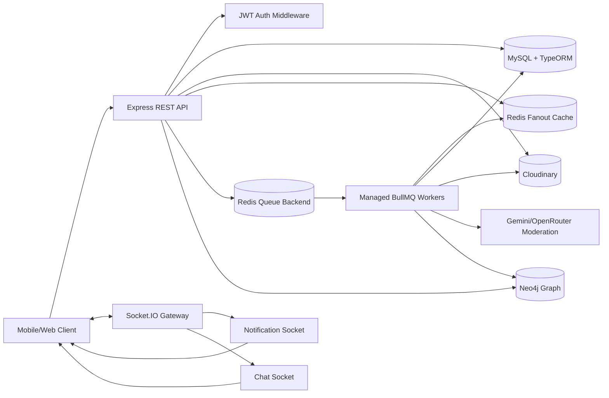

### 設計方針

このシステムでは、ワークロードを明確に 2 種類に分けています。

1. **同期パス**: クライアントへ正しいレスポンスを返すために必要な処理を担当します。例: 認証、バリデーション、データベース書き込み、投稿 ID の返却。
2. **非同期パス**: 重い処理や eventual consistency を許容できる処理を担当します。例: フィード配布、キャッシュ更新、興味プロファイルの書き込み、メディア削除、AI モデレーション。

この分離により、フォロワーが多いユーザー、Cloudinary の遅延、AI モデレーションの長い処理時間があっても、API レイテンシが大きく悪化しにくくなります。

<a id="core-modules"></a>
## 主要モジュール

| モジュール | 役割 |
| --- | --- |
| `auth` | 登録、ログイン、ログアウト、パスワードリセット |
| `post` | 投稿作成/編集/削除、フィード、投稿詳細、アップロード署名 |
| `postLike` | いいね/いいね解除、通知作成、キャッシュ更新、操作履歴記録 |
| `comment` | コメント、カーソルページネーション、通知、リアルタイムコメント |
| `follow` | フォロー/フォロー解除、非公開アカウントのフォロー申請、フィードウォームアップ、カウントキャッシュ |
| `graph` | フォローグラフ同期、プロフィール検索シグナル、フォロー候補 |
| `story` | 24 時間ストーリー、ストーリーフィード、ハイライト、モデレーション |
| `notification` | 通知 REST + Socket.IO リアルタイム |
| `conversation/message` | 1 対 1/グループチャット、メンバー管理、既読状態 |
| `user/profile` | 検索、プロフィール、アカウント更新 |
| `report` | コンテンツ/ユーザーの通報 |

<a id="data-model"></a>
## データモデル

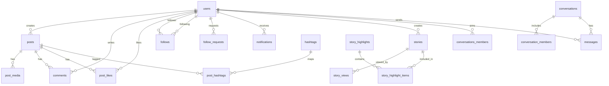

### MySQL における永続データ

MySQL は source of truth です。Redis はデータベースを置き換えるものではなく、キャッシュ/配信レイヤーとして機能します。投稿、メディア、ハッシュタグ、いいね数、コメント数、フォロー関係、通知、ストーリー、メッセージなどの重要データは、すべて `src/database` 内のエンティティとマイグレーションで管理されます。

高い一貫性が必要な操作は TypeORM トランザクションで包まれます。例:

- 投稿メタデータの更新 + ハッシュタグマッピングの差し替え。
- 投稿グラフ削除: いいね、コメント、ハッシュタグマッピング、メディア、投稿本体を削除。
- 非公開フォロー申請の承認: フォロー関係の作成、申請状態の更新、通知の作成。

<a id="redis-cache-design"></a>
## Redis キャッシュ設計

Redis は目的別に分けて使います。

| Key | Type | 内容 | 理由 |
| --- | --- | --- | --- |
| `feed:{userId}` | Sorted Set | ユーザーのフィード内の `postId` リスト。`createdAt.getTime()` をスコアにする | 高速なフィード取得、新しい順の維持、上位 100 件へのトリム |
| `post:data:{postId}` | Hash | フィード配信用スナップショット: caption、location、counts、created_at、tags、thumbnail、author | フィード読取時の複数テーブル JOIN を回避 |
| `user:interest:{userId}` | Hash | タグごとの興味重み | ランキングのパーソナライズ |
| `follow:count:followers:{userId}` | String + TTL | フォロワー数 | 繰り返しの count クエリを削減 |
| `follow:count:following:{userId}` | String + TTL | フォロー中数 | 繰り返しの count クエリを削減 |

### なぜフィードレスポンス全体をキャッシュしないのか

フィードレスポンスは次の要素に依存します。

- 現在時刻、つまり recency decay。
- 最新のエンゲージメント。
- 各ユーザー個別の興味プロファイル。
- キャッシュミスや孤立した投稿。
- フォロー/フォロー解除の状態。

そのため、このシステムは **フィードを描画するための素材** をキャッシュし、完全なレスポンスはキャッシュしません。この方式のほうが柔軟です。いいね/コメント/更新が発生したときは `post:data:{postId}` だけを更新すればよく、`feed:{userId}` は投稿 ID のリストを保持し続けます。

### キャッシュサイズ制限

各フィードは最新投稿を最大 100 件だけ保持します。

```text
ZADD feed:{userId} createdAtMs postId
ZREMRANGEBYRANK feed:{userId} 0 -101
```

Redis の sorted set はスコア昇順で並ぶため、上の trim コマンドは古い要素を削除し、最新 100 件を残します。読み取り時は次のように取得します。

```text
ZRANGE feed:{userId} 0 99 REV
```

<a id="bullmq-queue-design"></a>
## BullMQ キュー設計

| Queue | Trigger | Work | Retry/DLQ |
| --- | --- | --- | --- |
| `post-feed-fanout` | 投稿作成 | フォロワーを読み込み、各フォロワーと投稿者自身のフィードに投稿 ID を書き込む | 3 attempts、exponential backoff、DLQ |
| `post-cache-refresh` | 投稿更新、いいね/いいね解除、コメント/コメント削除 | MySQL から `post:data:{postId}` を再構築 | 3 attempts、DLQ |
| `post-delete` | 投稿削除 | 投稿キャッシュ削除、フォロワーフィードから投稿 ID を削除、Cloudinary メディア削除 | 3 attempts、DLQ |
| `user-interaction` | いいね/コメント/閲覧 | 操作履歴を挿入し、Redis の興味タグ重みを増加 | 3 attempts、DLQ |
| `unfollow-feed-cleanup` | フォロー解除 | 閲覧者のフィードからフォロー解除した相手の投稿を削除 | 3 attempts、DLQ |
| `ai-moderation` | 投稿作成 | AI コンテンツモデレーション | 3 attempts、DLQ |
| `story-moderation` | ストーリー作成 | AI ストーリーモデレーション | 3 attempts、DLQ |

各キューは専用の producer、processor、worker、DLQ を持ちます。これは運用上きれいなパターンです。ジョブがすべてのリトライを使い切ると、その payload は dead-letter queue に移動し、調査や手動再実行が可能になります。

<a id="detailed-system-flows"></a>
## 詳細なシステムフロー

### 1. 投稿作成フロー

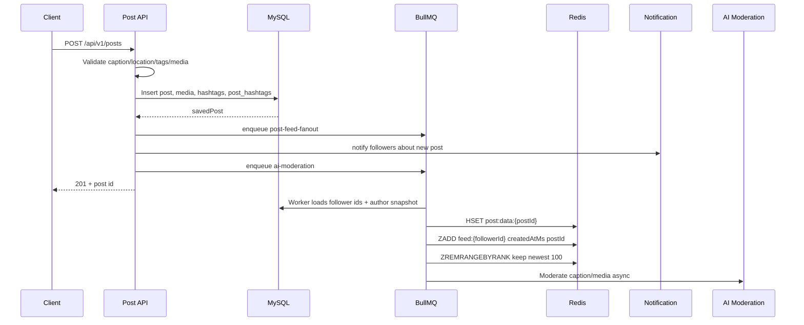

詳細:

1. クライアントは `/api/v1/posts/upload-signature` からアップロード署名を取得します。
2. クライアントはメディアを Cloudinary にアップロードします。
3. クライアントは `media_url`、`media_type`、caption、location、tags を付けて投稿作成 API を呼びます。
4. API はタグを正規化します。trim、小文字化、`#` の除去、重複排除、最大 20 タグ、タグ 1 つあたり最大 50 文字。
5. 永続データを保証するため、まずデータベースへ書き込みます。
6. API はリクエスト内で全フォロワーフィードへ直接書かず、fan-out ジョブを投入します。
7. フォロワー向け通知を作成します。
8. AI モデレーションはユーザーを待たせないよう非同期で実行します。

### 2. Fan-out on write フロー

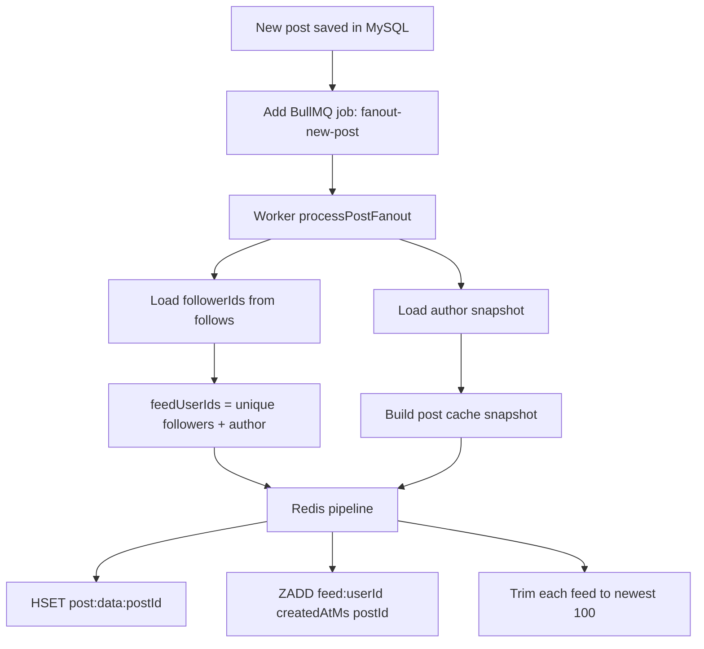

Fan-out on write は、書き込み増幅を受け入れる代わりに読み取りレイテンシを最適化します。

投稿者に `F` 人のフォロワーがいる場合、Redis 書き込み数はおおよそ次のようになります。

```text
RedisWrites = 1 HSET post:data:{postId} + F ZADD + F ZREMRANGEBYRANK
```

つまり、書き込み計算量は次の通りです。

```text
O(F)
```

一方で、フィード読み取りは軽量になります。

```text
O(K log K) to rank K posts retrieved from Redis, where K <= 100
```

ソーシャルネットワークでは、通常、書き込みより読み取りのほうが大幅に多くなります。

```text
R = average number of feed reads after each post
F = number of followers of the author
K = number of items in the feed cache
```

Fan-out on write が有利になる条件は次の通りです。

```text
R * Cost(join + filter DB) > F * Cost(redis write)
```

つまり、投稿作成時に追加コストを払うことで、フィードを開くたびに post/follow/media/hashtag/comment/like テーブルをまたぐ複数 JOIN を実行しなくて済むようにしています。

### 3. フィード読み取りフロー

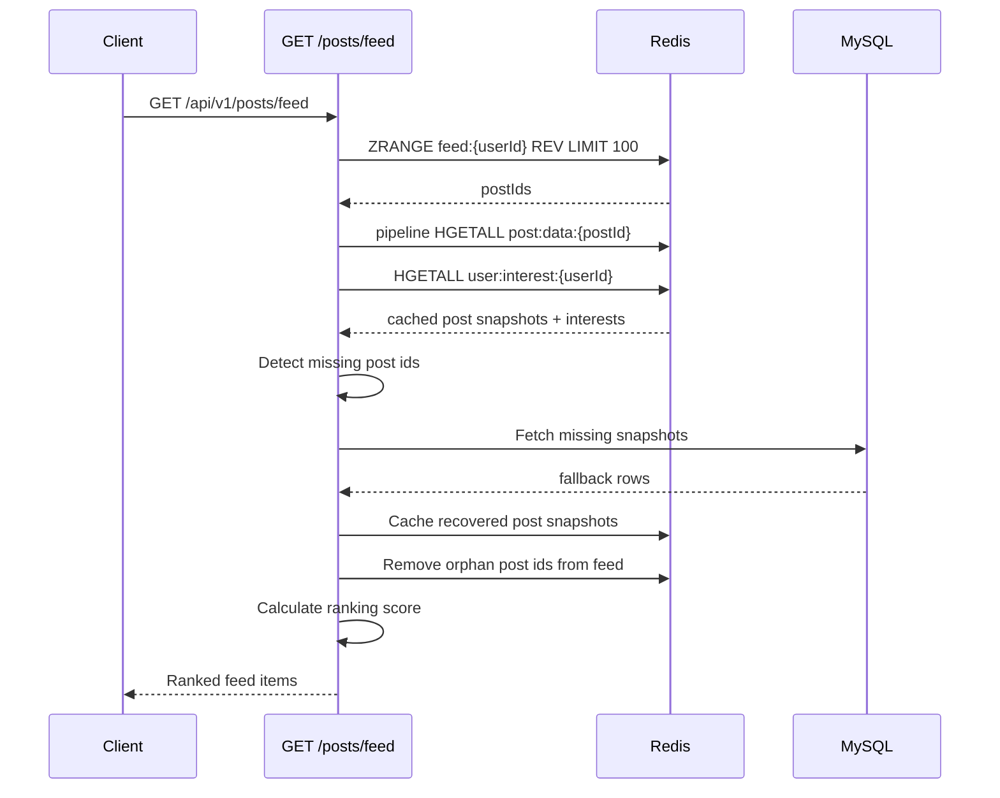

重要な点:

- `post:data:{postId}` がキャッシュミスしても API はフィードを失敗させず、MySQL にフォールバックします。
- フィード内の投稿 ID が DB に存在しない場合、孤立した投稿として扱い、フィードから削除します。
- ランキングは読み取り時に計算されるため、現在時刻と最新の興味プロファイルが反映されます。

### 4. 投稿更新フロー

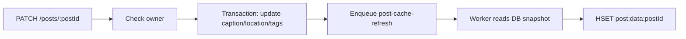

フィードは `postId` だけを保持しているため、メタデータ更新時に各 `feed:{userId}` を触る必要はありません。`post:data:{postId}` のスナップショットを更新するだけで、次にフィードを読むユーザーは新しい caption/location/tags/counts を受け取れます。

### 5. いいね/コメントとキャッシュ更新フロー

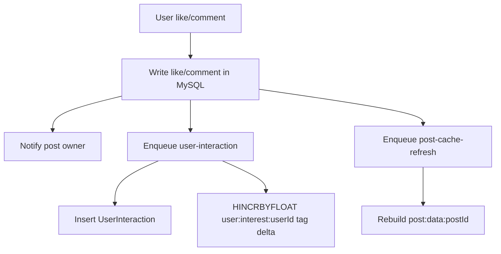

いいね/コメントには 2 つの効果があります。

1. **投稿のエンゲージメントが増える** ため、フィードランキングが最新カウントを反映できるようキャッシュスナップショットを更新する必要があります。
2. **ユーザーの興味プロファイルが変化する** ため、`user:interest:{userId}` にある投稿タグの重みを増やします。

操作ごとの重み:

```text
like    -> +1
comment -> +2
view    -> +0.2
```

コメントは、いいねよりもユーザーの労力が大きいため、より強いシグナルとして扱います。

### 6. 投稿削除フロー

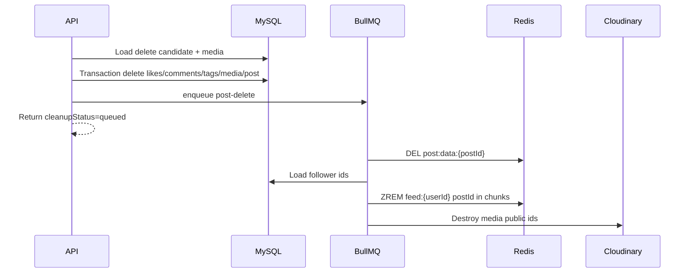

削除では、データベーストランザクションと補助的なクリーンアップを分離します。Cloudinary や Redis が遅くても API は待たされません。ワーカーはフォロワーフィードから投稿を削除するとき、`1000` ユーザー単位のバッチで処理します。

### 7. フォローフロー

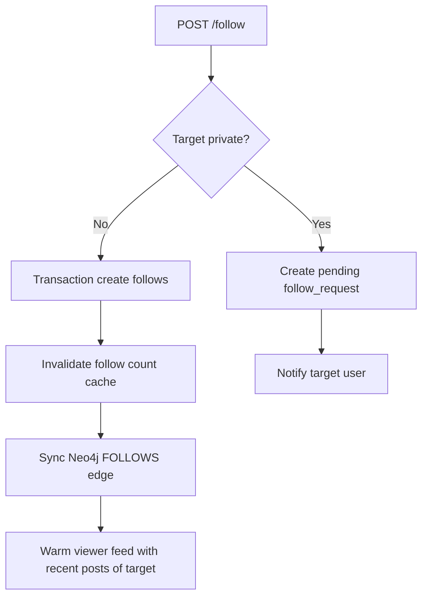

公開ユーザーをフォローした場合、フォロー先ユーザーの最新 10 投稿でフィードをウォームアップします。

```text
FOLLOW_FEED_WARMUP_LIMIT = 10
```

これにより、ユーザーが誰かをフォローした直後でも、その投稿者が新しい投稿をするまで待たずにコンテンツを表示できます。

### 8. フォロー解除フロー

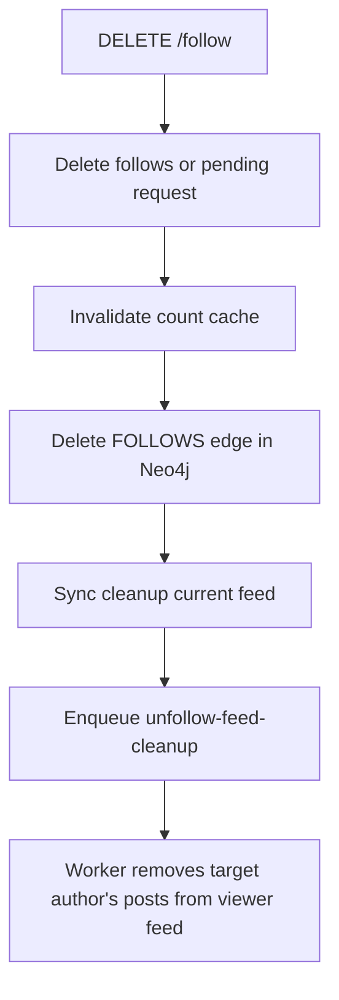

フォロー解除のクリーンアップは同期と非同期の両方で処理します。

- 同期クリーンアップは、UX 上すぐに正しい状態へ近づけるために実行します。
- 非同期クリーンアップは、同期処理が失敗した場合でも eventual consistency を保証する安全網です。

<a id="fan-out-on-write"></a>
## Fan-out on write

### Fan-out on write と fan-out on read

| 観点 | Fan-out on write | Fan-out on read |
| --- | --- | --- |
| 投稿作成時 | 投稿をフォロワーフィードへ書き込む | 投稿を DB にだけ書く |
| フィード読み取り時 | 事前構築済み Redis フィードを読む | フォロー中の投稿者を問い合わせ、投稿をマージする |
| 書き込みコスト | 高い。フォロワー数に比例 | 低い |
| 読み取りコスト | 低く安定 | 高い。フォロー数と投稿量に比例 |
| 向いているケース | 読み取りが多いアプリ | 小規模アプリ、または読み取り頻度が低いフィード |

このプロジェクトでは fan-out on write を使っています。ソーシャルフィードは一般に read-heavy で、ユーザーは投稿する回数よりフィードを開く回数のほうが多いためです。

### コスト式

定義:

- `F_a`: 投稿者 `a` のフォロワー数。
- `K`: 各フィードに保持する投稿数。現在は `K = 100`。
- `P`: ランキング後に表示する投稿数。
- `C_r`: Redis から 1 件読むコスト。
- `C_w`: Redis へ 1 件書くコスト。

投稿作成時のコスト:

```text
WriteCost(a) = C_db_insert + F_a * (C_w_zadd + C_w_trim) + C_w_hash
```

フィード読み取り時のコスト:

```text
ReadCost(u) = C_zrange(K) + K * C_hgetall + C_rank(K)
```

`K` は 100 に制限されるため、読み取りコストはほぼ定数です。

```text
ReadCost(u) = O(100) + O(100 log 100) ~= O(1)
```

一方、fan-out on read では通常次のようになります。

```text
ReadCostOnRead(u) = O(number_of_following * posts_per_author + merge + rank)
```

### 投稿処理ベンチマークスナップショット

次のベンチマークは、warm cache、partial cache miss、full cache miss の各シナリオで Redis + Queue 経路と MySQL-only baseline を比較したものです。指標として post write p95、feed read p95、wall-clock time、fan-out drain time、write/read throughput を追跡しています。

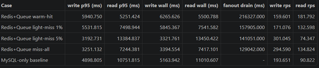

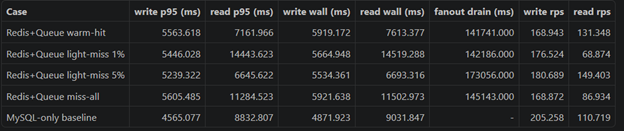

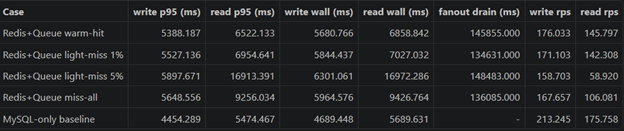

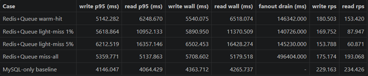

<a id="feed-ranking"></a>
## フィードランキング

フィードは単純に時刻順ではありません。各投稿は次の式でスコアリングされます。

```text
total_score = 0.50 * bounded_engagement
            + 0.35 * recency_score
            + 0.15 * interest_score
```

### 1. エンゲージメントスコア

生のエンゲージメント:

```text
engagement_raw = like_count + 2 * comment_count
```

コメントは、いいねより強い興味を示すため `2` 倍で重み付けします。

バイラル投稿が完全にランキングを支配しないよう、ログで正規化します。

```text
engagement_score = log(1 + engagement_raw) / log(1 + ENGAGEMENT_CAP)
bounded_engagement = min(1, engagement_score)
```

定数:

```text
ENGAGEMENT_CAP = 500
```

意図としては、初期のエンゲージメント増加を大きく評価し、時間が経つほど伸びを緩やかにします。0 から 10 件への増加は、1000 から 1010 件への増加より目立って評価されます。

### 2. 鮮度スコア

鮮度は half-life を持つ指数減衰で計算します。

```text
recency_score = exp(-ln(2) * age_hours / HALF_LIFE_HOURS)
```

定数:

```text
HALF_LIFE_HOURS = 18
```

18 時間後に recency score は 50% へ、36 時間後に 25% へ下がります。

コードでは時刻を 5 分単位の bucket に丸めます。

```text
RECENCY_BUCKET_MS = 5 * 60 * 1000
```

目的は、連続リクエスト間での微細なランキング揺れを減らすことです。

### 3. 興味スコア

各ユーザーについて、Redis は次のような map を保持します。

```text
user:interest:{userId} = {
  "travel": 4.2,
  "music": 2.0,
  "food": 1.4
}
```

投稿のタグ集合を `T` とすると、興味スコアは次のように計算します。

```text
max_interest = max(weight(tag) for all user interests)
hit_score(tag) = min(1, weight(tag) / max_interest)
interest_score = average(hit_score(tag) for tag in post.tags)
```

ユーザーに興味プロファイルがない場合、または投稿にタグがない場合:

```text
interest_score = 0
```

### ランキング例

仮定:

```text
like_count = 40
comment_count = 10
age_hours = 9
post.tags = ["travel", "food"]
userInterest = { travel: 4, food: 2, music: 1 }
```

計算:

```text
engagement_raw = 40 + 2 * 10 = 60
engagement_score = log(61) / log(501) ~= 0.661
bounded_engagement = 0.661

recency_score = exp(-ln(2) * 9 / 18) ~= 0.707

max_interest = 4
interest_score = average(4/4, 2/4) = 0.75

total_score = 0.50*0.661 + 0.35*0.707 + 0.15*0.75
            ~= 0.690
```

<a id="interest-model"></a>
## 興味モデル

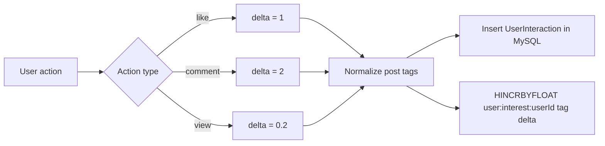

システムは 2 つのデータレイヤーを維持します。

- MySQL `user_interactions`: 監査と再構築のための行動履歴。
- Redis `user:interest:{userId}`: 高速ランキングのための配信用プロファイル。

Redis のデータが失われても、interaction table から興味プロファイルを再構築できます。

<a id="follow-suggestions-with-neo4j"></a>
## Neo4j によるフォロー候補

Neo4j は次のグラフを保存します。

```text
(User)-[:FOLLOWS]->(User)
(User)-[:VIEWED_FROM_SEARCH {count, firstSeenAt, lastSeenAt, lastQuery}]->(User)
```

### フォロー候補に MySQL ではなく Neo4j を使う理由

ソーシャルグラフは本質的に **関係とトラバーサル** の問題です。「友達の友達」を見つけるにはノード間のエッジを辿る必要があり、これはリレーショナルデータベースよりもグラフデータベースに自然に対応します。

下のグラフはフォロー関係の構造を示します。`user1` が現在のユーザーで、複数のユーザーをフォローしています。`user7` は **フォロー候補** です。`user4 -> user6 -> user7` という相互接続経由で到達でき、さらに検索から過去に閲覧されています。

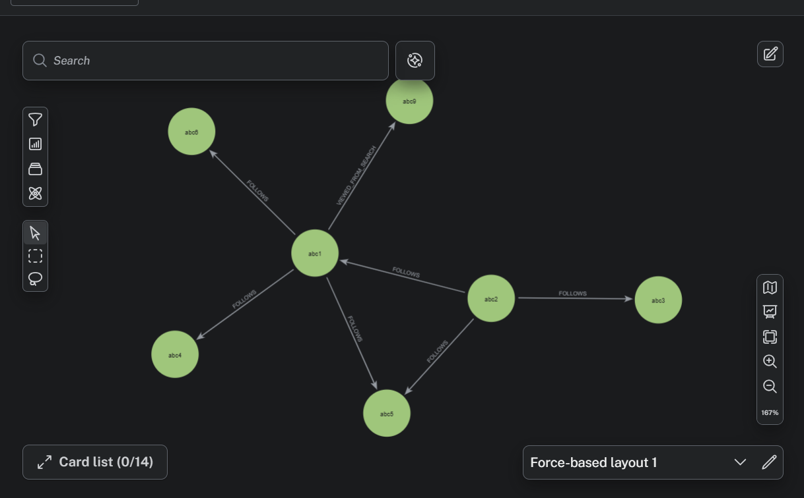
> `user7` の候補スコアが高い理由: `user4 -> user6` 経由の 2-hop mutual signal があり、さらに `user1` が最近プロフィールを閲覧しているため。

#### 同じクエリを 2 つのデータベースで書く

**シナリオ:** `userA` がまだフォローしていないが、`userA` がすでにフォローしている人たちがフォローしているユーザーを探し、相互接続数で並べ替える。

MySQL アプローチ:

```sql
SELECT
    f2.following_id AS suggested_user,
    COUNT(*) AS mutual_count
FROM follows f1
JOIN follows f2 ON f1.following_id = f2.follower_id
WHERE f1.follower_id = :userId
  AND f2.following_id != :userId
  AND f2.following_id NOT IN (
      SELECT following_id FROM follows WHERE follower_id = :userId
  )
GROUP BY f2.following_id
ORDER BY mutual_count DESC
LIMIT 10;
```

Neo4j アプローチ (Cypher):

```cypher
MATCH (me:User {id: $userId})-[:FOLLOWS]->(friend:User)-[:FOLLOWS]->(suggested:User)
WHERE suggested.id <> $userId
  AND NOT (me)-[:FOLLOWS]->(suggested)
WITH suggested, COUNT(friend) AS mutualCount
ORDER BY mutualCount DESC
LIMIT 10
RETURN suggested.id, mutualCount
```

どちらも同じ結果を返します。しかし実行モデルは根本的に異なります。

#### 各データベースがトラバーサルをどう扱うか

MySQL は関係を `follows` テーブルの行として保存します。友達の友達を探すには、次の処理が必要です。

1. `follower_id = userId` の行を scan/index lookup し、直接の友達を取得する。
2. 各友達について `follower_id = friendId` を再度 scan し、その人のフォロー先を取得する。
3. すでにフォロー済みのユーザーを除外する。
4. 集計してソートする。

各 hop は JOIN です。depth 2 でも 2 回の index scan と self-join が必要になります。depth 3 になると JOIN が 3 つになり、フィルタ前の中間結果が何百万行に膨らむ可能性があります。

Neo4j は関係をディスク上の first-class pointer として保存します。各ノードは接続エッジへの参照を直接持ちます。トラバーサルはテーブルの scan/join ではなく、メモリポインタを辿る処理です。hop を 3、4 と増やしても、Cypher パターンに `-[:FOLLOWS]->` を 1 つ追加するだけです。

#### 比較

| 観点 | MySQL | Neo4j |
|---|---|---|
| データモデル | `follows` テーブルの行 | ネイティブなノードとエッジ |
| Depth-2 query | 2 つの self-join、index scan | pointer traversal、JOIN なし |
| Depth-3+ query | 急激に重くなる | Cypher に 1 hop 追加するだけ |
| Search-view signal | 別テーブルとの追加 JOIN | 同じグラフ上の別エッジタイプ |
| Combined scoring query | 複雑な multi-join + subquery | 単一の Cypher pattern |
| Read performance at scale | フォロワー数に応じて悪化 | index-free adjacency により安定 |
| Write overhead | 単純な INSERT/DELETE | 同期が必要、追加 job |
| Operational complexity | 既存 stack 内 | 追加サービスとして運用が必要 |
| Team familiarity | 高い | 低い。Cypher は新しい query language |

#### このプロジェクトが Neo4j を使う理由

フォロー候補機能は 2 つのシグナルを組み合わせます。

1. **相互フォロー**: フォローグラフ上の friends of friends。
2. **検索閲覧履歴**: 閲覧者が最近検索またはクリックしたプロフィール。

MySQL でこれらを組み合わせるには、`follows` を depth 2 のために 2 回 JOIN し、さらに `search_views` テーブルと JOIN し、重み付き集計を行う必要があります。クエリは multi-level self-join と subquery を含む形になります。動作はしますが拡張しにくく、3 つ目のシグナルを追加するたびに JOIN が増えていきます。

Neo4j では、2 つのシグナルは同じグラフ上の `[:FOLLOWS]` と `[:VIEWED_FROM_SEARCH]` という 2 種類のエッジです。3 つ目のシグナルを追加する場合も、エッジタイプと `MATCH` 句を追加するだけで、スコア式は読みやすいままです。

```cypher
MATCH (me:User {id: $userId})-[:FOLLOWS]->(friend)-[:FOLLOWS]->(suggested)
WHERE suggested <> me AND NOT (me)-[:FOLLOWS]->(suggested)
WITH suggested, COUNT(friend) AS mutualCount

OPTIONAL MATCH (me)-[v:VIEWED_FROM_SEARCH]->(suggested)
WITH suggested, mutualCount, COALESCE(v.count, 0) AS viewCount, v.lastSeenAt AS lastSeen

RETURN suggested.id, mutualCount, viewCount, lastSeen
ORDER BY (0.6 * mutualCount + 0.25 * viewCount) DESC
LIMIT 10
```

#### 受け入れているトレードオフ

Neo4j を使うと運用コストが増えます。デプロイ、監視、バックアップが必要な追加サービスになるためです。また follow/unfollow が発生したとき、MySQL と Neo4j の両方を更新する必要があります。このプロジェクトでは BullMQ の非同期ジョブで同期します。

このトレードオフはフォロー候補機能にとって妥当です。

- グラフクエリが同等の multi-join SQL より単純で保守しやすい。
- ソーシャルグラフが大きくなっても traversal performance が安定しやすい。
- MySQL は source of truth のままで、Neo4j は graph query 用の read-optimized serving layer に過ぎない。

プロジェクトがさらに小さい場合や候補機能が単純な場合、たとえば 1 hop のみで複合シグナルがない場合は、MySQL で十分であり Neo4j は不要な複雑性になります。

フォロー候補は次の要素を組み合わせます。

1. 相互フォロー: friends of friends。
2. 検索プロフィール閲覧: 閲覧者が検索または閲覧したユーザー。
3. 鮮度: 最近閲覧したプロフィールほど高く評価。

式:

```text
score = 0.60 * min(mutualFollowCount, MUTUAL_FOLLOW_CAP) / MUTUAL_FOLLOW_CAP
      + 0.25 * log(1 + min(searchViewCount, SEARCH_VIEW_CAP)) / log(1 + SEARCH_VIEW_CAP)
      + 0.15 * recencyScore
```

定数:

```text
MUTUAL_FOLLOW_CAP = 10
SEARCH_VIEW_CAP = 20
SEARCH_HALF_LIFE_HOURS = 168
```

鮮度:

```text
recencyScore = exp(-ln(2) * hours_since_last_seen / 168)
```

これにより、候補は静的なソーシャルグラフだけで決まらず、最近の検索行動からも学習します。

<a id="realtime-flow"></a>
## リアルタイムフロー

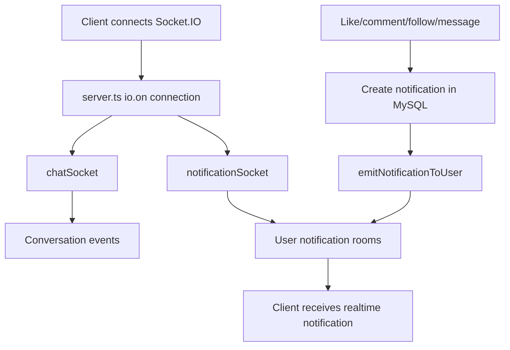

リアルタイム機能の用途:

- いいね/コメント/フォロー/新規投稿/新規ストーリーの通知。
- 1 対 1 とグループチャット。
- 投稿への新規コメント。

<a id="ai-moderation-flow"></a>
## AI モデレーションフロー

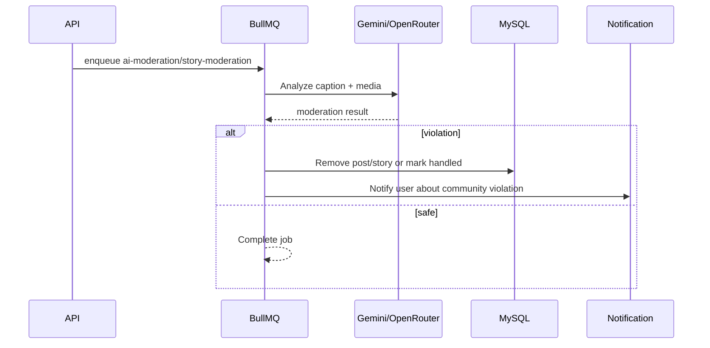

モデレーションは非同期で実行されるため、アップロードや投稿作成を遅くしません。AI サービスが失敗した場合、BullMQ は exponential backoff でリトライし、それでも失敗したジョブを DLQ に送ります。

## キャッシュ一貫性戦略

| シナリオ | 処理 |
| --- | --- |
| 新規投稿 | Fan-out job が `post:data` と `feed:{userId}` を書き込む |
| caption/location/tags 更新 | `post:data:{postId}` を更新 |
| いいね/いいね解除 | 更新後の count を反映するため `post:data:{postId}` を更新 |
| コメント/コメント削除 | 更新後の count を反映するため `post:data:{postId}` を更新 |
| 投稿削除 | `post:data` を削除し、フォロワーフィードから投稿 ID を ZREM |
| フォロー | 対象ユーザーの最新 10 投稿でフィードをウォームアップ |
| フォロー解除 | 対象ユーザーの投稿を閲覧者フィードから削除 |
| フィード読取時のキャッシュミス | DB にフォールバックし、その後再キャッシュ |
| 孤立した投稿 ID | フィードから削除 |
| Redis down | API は DB を source of truth として動作し、queue/cache は後から復旧可能 |

このシステムはフィードキャッシュについて **eventual consistency** を受け入れます。重要なのはデータベースが常に正しいことであり、キャッシュは更新または読み取り時に自己修復できます。

<a id="api-surface"></a>
## API サーフェス

Base path: `/api/v1`.

### Auth

| Method | Path | 目的 |
| --- | --- | --- |
| `POST` | `/api/v1/auth/register` | 登録 |
| `POST` | `/api/v1/auth/login` | ログイン |
| `POST` | `/api/v1/auth/logout` | ログアウト |
| `POST` | `/api/v1/auth/reset-password-direct` | パスワードリセット |

### Post & feed

| Method | Path | 目的 |
| --- | --- | --- |
| `GET` | `/api/v1/posts/feed` | ランキング済みフィード取得 |
| `GET` | `/api/v1/posts/upload-signature` | Cloudinary アップロード署名取得 |
| `POST` | `/api/v1/posts` | 投稿作成 |
| `GET` | `/api/v1/posts/:postId` | 投稿詳細 + コメント |
| `PATCH` | `/api/v1/posts/:postId` | caption/location/tags 更新 |
| `DELETE` | `/api/v1/posts/:postId` | 投稿削除 + 非同期クリーンアップ |

### Interaction

| Method | Path | 目的 |
| --- | --- | --- |
| `POST` | `/api/v1/post-likes/:postId` | 投稿にいいね |
| `DELETE` | `/api/v1/post-likes/:postId` | 投稿のいいね解除 |
| `GET` | `/api/v1/comments/:postId` | カーソル付きコメント一覧 |
| `POST` | `/api/v1/comments/:postId` | コメント作成 |
| `DELETE` | `/api/v1/comments/:commentId` | コメント削除 |

### Follow

| Method | Path | 目的 |
| --- | --- | --- |
| `POST` | `/api/v1/follow` | フォローまたはフォロー申請 |
| `DELETE` | `/api/v1/follow` | フォロー解除または申請キャンセル |
| `POST` | `/api/v1/follow/accept` | フォロー申請承認 |
| `POST` | `/api/v1/follow/reject` | フォロー申請拒否 |
| `GET` | `/api/v1/follow/suggestions` | Neo4j からフォロー候補取得 |
| `GET` | `/api/v1/users/:userId/followers` | フォロワー一覧 |
| `GET` | `/api/v1/users/:userId/following` | フォロー中一覧 |

### Story

| Method | Path | 目的 |
| --- | --- | --- |
| `GET` | `/api/v1/stories/feed` | ストーリーフィード |
| `POST` | `/api/v1/stories` | ストーリー作成 |
| `GET` | `/api/v1/stories/me` | 自分のストーリー |
| `GET` | `/api/v1/stories/users/:userId` | ユーザーのストーリー |
| `DELETE` | `/api/v1/stories/:id` | ストーリー削除 |
| `POST` | `/api/v1/stories/highlights` | ハイライト作成 |
| `GET` | `/api/v1/stories/highlights/me` | 自分のハイライト |
| `PATCH` | `/api/v1/stories/highlights/:highlightId` | ハイライト更新 |

### Notification, profile, user, conversation

| Group | Sample endpoints |
| --- | --- |
| Notification | `GET /api/v1/notifications`, `GET /summary`, `PATCH /read-all`, `DELETE /read` |
| Profile | `GET /api/v1/profile/users/:userId`, `PATCH /me`, `POST /users/:userId/search-view` |
| User | `GET /api/v1/users/search`, `GET /api/v1/users/:id` |
| Conversation | private chat, group chat, members, messages, read state |

<a id="installation-and-running-the-project"></a>
## インストールと実行

### 1. 依存関係のインストール

```bash
npm install
```

### 2. `.env` ファイルの作成

```env
JWT_SECRET=your_jwt_secret

CLOUDINARY_CLOUD_NAME=your_cloud_name
CLOUDINARY_API_KEY=your_api_key
CLOUDINARY_API_SECRET=your_api_secret
CLOUDINARY_POST_FOLDER=posts
CLOUDINARY_STORY_FOLDER=stories

REDIS_URL=redis://127.0.0.1:6379
REDIS_URL_QUEUE=redis://127.0.0.1:6379

NEO4J_ENABLED=true
NEO4J_URI=neo4j://127.0.0.1:7687
NEO4J_USERNAME=neo4j
NEO4J_PASSWORD=your_password
NEO4J_DATABASE=neo4j

GEMINI_API_KEY=your_gemini_key
GEMINI_MODEL=gemini-1.5-flash-latest
OPENROUTER_API_KEY=your_openrouter_key
OPENROUTER_MODEL=google/gemini-2.0-flash-exp:free
```

データベース設定は `src/core/config/database.ts` と `src/data-source.ts` にあります。

### 3. マイグレーション実行

```bash
npm run build
npm run migration:run
```

### 4. 開発サーバー起動

```bash
npm run dev
```

サーバーは次で起動します。

```text
http://localhost:3000
```

<a id="interview-highlights"></a>
## 面接で説明しやすいポイント

### 1. 意図的に作られたフィード配信レイヤー

このプロジェクトでは、フィードを毎回データベースから直接問い合わせません。代わりに:

- Redis sorted set がユーザーごとの投稿 ID リストを保存します。
- Redis hash が投稿スナップショットを保存します。
- API は読み取り時に再ランキングします。
- キャッシュミスはデータベースから自己修復します。

これは read-heavy なワークロードに向いたシステム設計の考え方を示しており、ソーシャルネットワークに適しています。

### 2. 制御された fan-out on write

投稿作成はフォロワー数にブロックされません。API はジョブを投入するだけで、ワーカーが Redis pipeline を使って fan-out を処理します。retry と DLQ も備えており、レイテンシ、信頼性、運用上の問題を考慮していることを示します。

### 3. 実用的な eventual consistency

いいね、コメント、更新などの変更はフィード全体を再構築しません。システムは `post:data:{postId}` スナップショットを更新し、フィードの ID リストはそのままにします。これによりキャッシュ無効化の影響範囲を小さくできます。

### 4. 明示的なランキング式

ランキングはブラックボックスではありません。式は次を組み合わせます。

- log-scaled engagement。
- recency の exponential decay。
- ユーザー行動から作られる興味プロファイル。

これによりランキングをデバッグしやすくなっています。debug mode が有効な場合、API は `ranking_debug` を公開します。

### 5. 専用のグラフレコメンデーション

フォロー候補は Neo4j を使って mutual-follow と search-view graph を問い合わせます。これは一般的な CRUD バックエンドと比べて意味のある差別化要素です。

### 6. キュー駆動のリスクのある操作

Cloudinary cleanup、AI moderation、fan-out、cache refresh、interaction tracking はすべて BullMQ で処理します。外部サービスが失敗した場合でも、システムは primary request を失敗させる代わりにリトライし、最終的に DLQ へ移します。

### 7. 永続データと並行したリアルタイム

通知はまず MySQL に書き込まれ、その後 Socket.IO で送信されます。クライアントはすぐにリアルタイム更新を受け取れますが、ページを再読み込みしても永続化されたデータが表示されます。

## 今後の改善

- API から worker を独立したプロセス/コンテナへ切り出し、個別にスケールできるようにする。
- Redis cluster を使う、または `feed:{userId}` を user ID で partition する。
- hybrid fan-out を追加する。著名人アカウントは write amplification を避けるため fan-out on read または partial fan-out を使う。
- outbox pattern を追加し、ジョブ投入をデータベーストランザクションと atomic にする。
- observability を追加する。queue latency、DLQ count、feed cache hit rate、p95 feed latency。
- 古い投稿スナップショット向けに Redis TTL/eviction policy を追加する。
- 非アクティブユーザーが戻ってきたときの background feed rebuilding を追加する。
