# SMedia Backend - Social Media System

Backend for a small-scale Instagram/Facebook-style social network, focused on news feed, follow graph, real-time chat/notifications, stories, moderation, and distributed data caching using Redis + BullMQ.

The standout feature of the system is a feed designed around **fan-out on write**: when a user creates a post, the system first durably writes data to MySQL, then pushes an asynchronous job to distribute the post ID into each follower's feed cache. When reading the feed, the API retrieves the list of post IDs from Redis, fetches post data snapshots in batches, recovers cache misses from the database, then re-ranks by engagement, recency, and the user's interest profile.

## Table of Contents

- [Tech stack](#tech-stack)
- [High-level architecture](#high-level-architecture)
- [Core modules](#core-modules)
- [Data model](#data-model)
- [Redis cache design](#redis-cache-design)
- [BullMQ queue design](#bullmq-queue-design)
- [Detailed system flows](#detailed-system-flows)
- [Fan-out on write](#fan-out-on-write)
- [Feed ranking](#feed-ranking)
- [Interest model](#interest-model)
- [Follow suggestions with Neo4j](#follow-suggestions-with-neo4j)
- [Realtime flow](#realtime-flow)
- [AI moderation flow](#ai-moderation-flow)
- [API surface](#api-surface)
- [Installation and running the project](#installation-and-running-the-project)
- [Interview highlights](#interview-highlights)

## Tech stack

| Layer | Technology | Role |
| --- | --- | --- |
| Runtime | Node.js, TypeScript, Express 5 | REST API, business logic |
| Database | MySQL, TypeORM | Primary data store: user, post, comment, follow, story, message |
| Cache | Redis | Feed cache, post snapshot cache, user interest, count cache |
| Queue | BullMQ | Feed fan-out, cache refresh, delete cleanup, user interaction, moderation |
| Realtime | Socket.IO | Chat, notifications, real-time comments |
| Graph DB | Neo4j | Follow graph, mutual-follow suggestions, search-view signals |
| Media | Cloudinary | Upload, store images/videos, media cleanup on delete |
| AI | Gemini/OpenRouter | Content moderation for posts/stories |
| Auth | JWT, bcrypt | Login, request authentication |

## High-level architecture

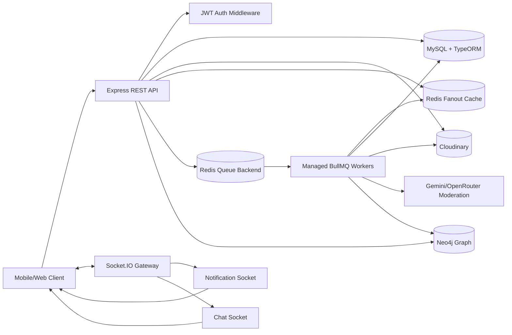

### Design philosophy

The system clearly separates two types of workloads:

1. **Synchronous path**: handles steps that are required to return a correct response to the client — e.g. authentication, validation, database writes, returning post IDs.
2. **Asynchronous path**: handles heavy work or work that can be eventually consistent — e.g. feed distribution, cache refresh, writing interest profiles, deleting media, AI moderation.

This separation ensures the API is not slowed down when a user has many followers, when Cloudinary is slow, or when AI moderation takes a long time.

## Core modules

| Module | Role |
| --- | --- |
| `auth` | Register, login, logout, reset password |
| `post` | Create/edit/delete posts, feed, post detail, upload signature |
| `postLike` | Like/unlike, create notification, refresh cache, record interaction |
| `comment` | Comment, cursor pagination, notification, real-time comment |
| `follow` | Follow/unfollow, private follow request, warm feed, count cache |
| `graph` | Sync follow graph, profile search signal, follow suggestions |
| `story` | 24h story, story feed, highlights, moderation |
| `notification` | Notification REST + Socket.IO real-time |
| `conversation/message` | Private/group chat, member management, read state |
| `user/profile` | Search, profile, update account |
| `report` | Report content/users |

## Data model

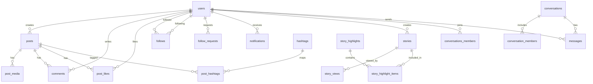

### Durable data in MySQL

MySQL is the source of truth. Redis does not replace the database — it acts as a cache/serving layer. Important data such as posts, media, hashtags, like counts, comment counts, follow relationships, notifications, stories, and messages all have entities and migrations in `src/database`.

Operations requiring high consistency are wrapped in TypeORM transactions, for example:

- Updating post metadata + replacing hashtag mappings.
- Post graph deletion: removing likes, comments, hashtag mappings, media, then the post.
- Accepting a private follow request: creating the follow relationship, updating the request, creating a notification.

## Redis cache design

Redis is divided by purpose:

| Key | Type | Contents | Reason |
| --- | --- | --- | --- |
| `feed:{userId}` | Sorted Set | List of `postId`s in the user's feed, scored by `createdAt.getTime()` | Fast feed retrieval, maintains newest-first order, trim to top 100 |
| `post:data:{postId}` | Hash | Feed-serving snapshot: caption, location, counts, created_at, tags, thumbnail, author | Avoids multi-table joins when reading feed |
| `user:interest:{userId}` | Hash | Interest weights by tag | Personalizes ranking |
| `follow:count:followers:{userId}` | String + TTL | Follower count | Reduces repeated count queries |
| `follow:count:following:{userId}` | String + TTL | Following count | Reduces repeated count queries |

### Why not cache the entire feed response?

The feed response depends on:

- the current time (recency decay);
- the latest engagement;
- each user's individual interest profile;
- cache misses / orphan posts;
- follow/unfollow state.

Therefore the system caches **the raw ingredients to render the feed**, not the full response. This approach is more flexible: only `post:data:{postId}` needs to be updated when a like/comment/update occurs, while `feed:{userId}` continues to hold the list of post IDs.

### Cache size limit

Each feed holds at most 100 of the latest posts:

```text
ZADD feed:{userId} createdAtMs postId
ZREMRANGEBYRANK feed:{userId} 0 -101
```

With Redis sorted sets ordered in ascending score order, the trim command above removes the oldest elements, keeping the 100 newest. When reading:

```text
ZRANGE feed:{userId} 0 99 REV
```

## BullMQ queue design

| Queue | Trigger | Work | Retry/DLQ |
| --- | --- | --- | --- |
| `post-feed-fanout` | Post created | Load followers, write post ID into each follower's and author's feed | 3 attempts, exponential backoff, DLQ |
| `post-cache-refresh` | Post updated, like/unlike, comment/delete comment | Rebuild `post:data:{postId}` from MySQL | 3 attempts, DLQ |
| `post-delete` | Post deleted | Delete post cache, remove post ID from follower feeds, delete Cloudinary media | 3 attempts, DLQ |
| `user-interaction` | Like/comment/view | Insert interaction, increment interest tag weight in Redis | 3 attempts, DLQ |
| `unfollow-feed-cleanup` | Unfollow | Remove the unfollowed author's posts from the viewer's feed | 3 attempts, DLQ |
| `ai-moderation` | Post created | AI content moderation | 3 attempts, DLQ |
| `story-moderation` | Story created | AI story moderation | 3 attempts, DLQ |

Each queue has its own producer, processor, worker, and DLQ. This is an operationally clean pattern: when a job exhausts all retry attempts, its payload moves to the dead-letter queue where it can be inspected and manually replayed.

## Detailed system flows

### 1. Create post flow

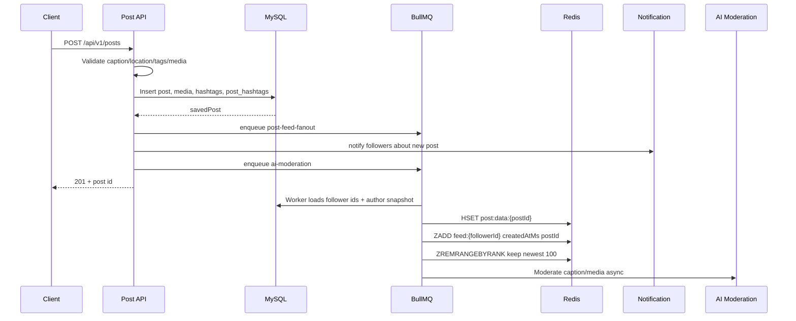

Details:

1. Client fetches an upload signature from `/api/v1/posts/upload-signature`.
2. Client uploads media to Cloudinary.
3. Client calls create post with `media_url`, `media_type`, caption, location, and tags.
4. API normalizes tags: trim, lowercase, strip `#` characters, deduplicate, cap at 20 tags, max 50 characters per tag.
5. Database writes first to ensure durable data.
6. API enqueues a fan-out job instead of writing to all follower feeds inline within the request.
7. A notification is created for followers.
8. AI moderation runs asynchronously so as not to block the user.

### 2. Fan-out on write flow

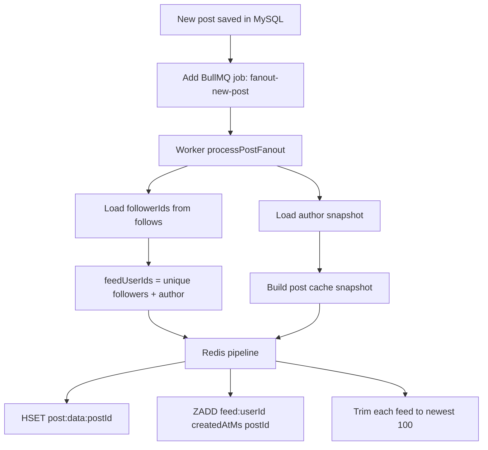

Fan-out on write trades write amplification for optimized read latency.

If an author has `F` followers, the number of Redis writes is approximately:

```text
RedisWrites = 1 HSET post:data:{postId} + F ZADD + F ZREMRANGEBYRANK
```

That is, write complexity is:

```text
O(F)
```

But reading the feed becomes lightweight:

```text
O(K log K) to rank K posts retrieved from Redis, where K <= 100
```

In social networks, reads significantly outnumber writes. If:

```text
R = average number of feed reads after each post
F = number of followers of the author
K = number of items in the feed cache
```

Fan-out on write is beneficial when:

```text
R * Cost(join + filter DB) > F * Cost(redis write)
```

In other words, the system accepts extra cost at post-creation time so that every feed open does not require multiple joins across post/follow/media/hashtag/comment/like tables.

### 3. Read feed flow

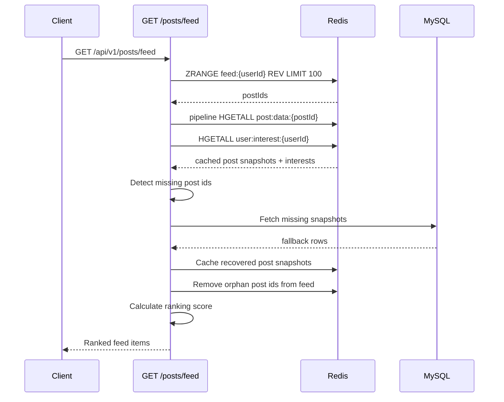

Key points:

- If `post:data:{postId}` is a cache miss, the API does not fail the feed — it falls back to MySQL.
- If a post ID in the feed no longer exists in the DB, the API treats it as an orphan and removes it from the feed.
- Ranking is computed at read time to reflect the current moment and the latest interest profile.

### 4. Update post flow

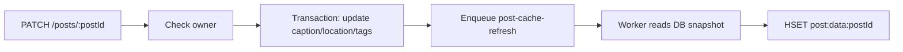

Updating metadata does not require touching each `feed:{userId}`, since the feed only stores `postId`. Simply refreshing the `post:data:{postId}` snapshot means anyone reading the feed afterward will see the new caption/location/tags/counts.

### 5. Like/comment and cache refresh flow

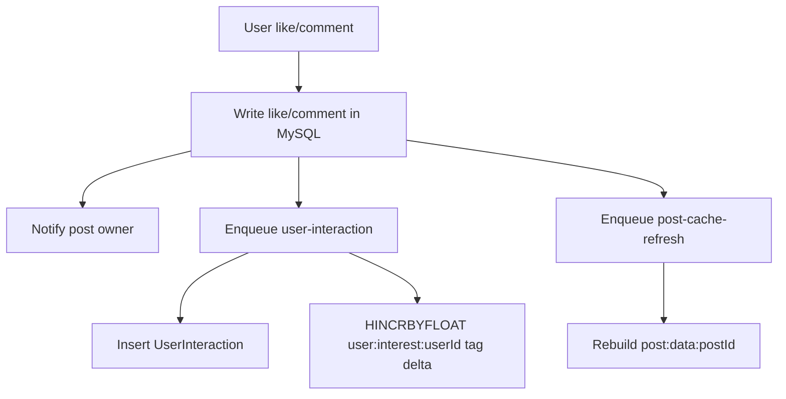

A like/comment has two effects:

1. **The post's engagement increases**, so the cache snapshot needs to be refreshed for the feed ranking to reflect the new counts.
2. **The user's interest profile changes**, so `user:interest:{userId}` increases the weight for the post's tags.

Interaction weights:

```text
like    -> +1
comment -> +2
view    -> +0.2
```

Comments are treated as a stronger signal than likes because the user expends more effort.

### 6. Delete post flow

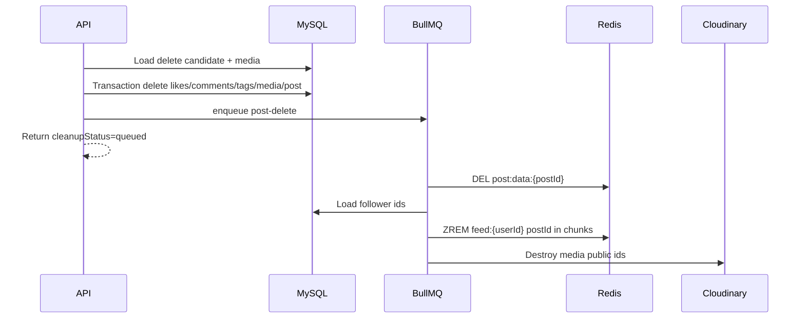

Deletion separates the database transaction from the ancillary cleanup. If Cloudinary or Redis is slow, the API is not held up. The worker processes follower feeds in batches of `1000` users when removing posts from feeds.

### 7. Follow flow

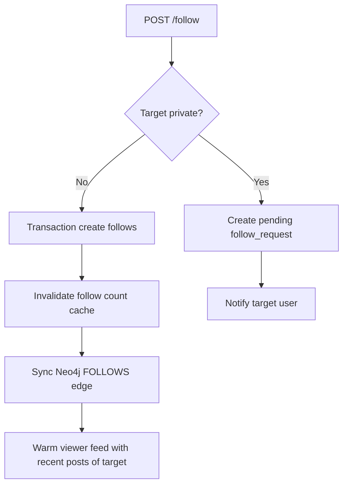

When following a public user, the system warms the feed with the 10 most recent posts from the followed user:

```text
FOLLOW_FEED_WARMUP_LIMIT = 10
```

This allows a user who just followed someone to immediately see content without waiting for the author to publish a new post.

### 8. Unfollow flow

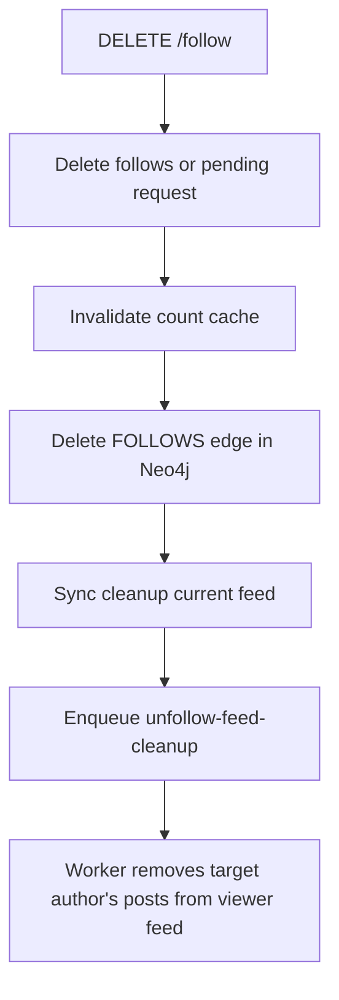

Unfollow cleanup is handled both synchronously and asynchronously:

- Sync cleanup attempts immediate removal for correct UX.
- Async cleanup is a safety net to ensure eventual consistency if the sync step fails.

## Fan-out on write

### Fan-out on write vs fan-out on read

| Criterion | Fan-out on write | Fan-out on read |
| --- | --- | --- |
| On post creation | Writes post into follower feeds | Only writes post to DB |
| On feed read | Reads pre-built Redis feed | Queries followed authors then merges posts |
| Write cost | Higher, proportional to follower count | Low |
| Read cost | Low, stable | High, proportional to following count and post volume |
| Best suited for | Read-heavy apps | Small apps or low-read feeds |

This project uses fan-out on write because social feeds are typically read-heavy. Users open their feed far more often than they post.

### Cost formula

Let:

- `F_a`: follower count of author `a`.
- `K`: posts kept in each feed, currently `K = 100`.
- `P`: posts to display after ranking.
- `C_r`: cost to read one item from Redis.
- `C_w`: cost to write one item to Redis.

Cost when creating a post:

```text
WriteCost(a) = C_db_insert + F_a * (C_w_zadd + C_w_trim) + C_w_hash
```

Cost when reading the feed:

```text
ReadCost(u) = C_zrange(K) + K * C_hgetall + C_rank(K)
```

Because `K` is capped at 100, read cost is near-constant:

```text
ReadCost(u) = O(100) + O(100 log 100) ~= O(1)
```

While fan-out on read typically requires:

```text
ReadCostOnRead(u) = O(number_of_following * posts_per_author + merge + rank)
```

## Feed ranking

The feed is not simply sorted by time. Each post is scored as:

```text
total_score = 0.50 * bounded_engagement
            + 0.35 * recency_score
            + 0.15 * interest_score
```

### 1. Engagement score

Raw engagement:

```text
engagement_raw = like_count + 2 * comment_count
```

Comments are weighted `2` because they signal stronger interest than likes.

Normalized with a log to prevent viral posts from completely dominating:

```text
engagement_score = log(1 + engagement_raw) / log(1 + ENGAGEMENT_CAP)
bounded_engagement = min(1, engagement_score)
```

Where:

```text
ENGAGEMENT_CAP = 500
```

The intent: engagement grows quickly in the early stages but plateaus over time. A post going from 0 to 10 interactions is rewarded more noticeably than one going from 1000 to 1010.

### 2. Recency score

Recency uses exponential decay with a half-life:

```text
recency_score = exp(-ln(2) * age_hours / HALF_LIFE_HOURS)
```

Where:

```text
HALF_LIFE_HOURS = 18
```

After 18 hours the recency score drops to 50%. After 36 hours, to 25%.

The code rounds time to 5-minute buckets:

```text
RECENCY_BUCKET_MS = 5 * 60 * 1000
```

The goal is to reduce tiny ranking fluctuations between consecutive requests.

### 3. Interest score

For each user, Redis stores a map:

```text
user:interest:{userId} = {
  "travel": 4.2,
  "music": 2.0,
  "food": 1.4
}
```

For a post with tag set `T`, the interest score is calculated as:

```text
max_interest = max(weight(tag) for all user interests)
hit_score(tag) = min(1, weight(tag) / max_interest)
interest_score = average(hit_score(tag) for tag in post.tags)
```

If the user has no interest profile or the post has no tags:

```text
interest_score = 0
```

### Ranking example

Suppose:

```text
like_count = 40
comment_count = 10
age_hours = 9
post.tags = ["travel", "food"]
userInterest = { travel: 4, food: 2, music: 1 }
```

Calculation:

```text
engagement_raw = 40 + 2 * 10 = 60
engagement_score = log(61) / log(501) ~= 0.661
bounded_engagement = 0.661

recency_score = exp(-ln(2) * 9 / 18) ~= 0.707

max_interest = 4
interest_score = average(4/4, 2/4) = 0.75

total_score = 0.50*0.661 + 0.35*0.707 + 0.15*0.75
            ~= 0.690
```

## Interest model

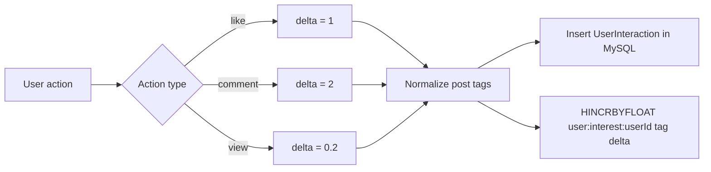

The system maintains two data layers:

- MySQL `user_interactions`: behavioral history for auditing and rebuilding.
- Redis `user:interest:{userId}`: a serving profile for fast ranking.

If Redis loses data, interest can be rebuilt from the interaction table.

## Follow suggestions with Neo4j

Neo4j stores the graph:

```text
(User)-[:FOLLOWS]->(User)
(User)-[:VIEWED_FROM_SEARCH {count, firstSeenAt, lastSeenAt, lastQuery}]->(User)
```

### Why Neo4j instead of MySQL for follow suggestions?

Social graphs are fundamentally about **relationships and traversal**. Finding "friends of friends" requires following edges across nodes, which maps naturally to a graph database but becomes expensive in a relational one.
The graph below illustrates the follow relationship structure. `user1` (current user)
follows several others. `user7` is a **follow suggestion** — reachable via a mutual
connection (`user4 → user6 → user7`) and also previously viewed from search.

```
      [user2]        [user3]
         ↑ ←FOLLOWS   ↑
    FOLLOWS↗           ↖FOLLOWS
         [user1] ──FOLLOWS──→ [user5]
         FOLLOWS↘
              [user4]
                 ↓ FOLLOWS
              [user6]
                 ↓ FOLLOWS
    - - - → [user7] ← · · VIEWED_FROM_SEARCH (user1)
```

> `user7` scores high in suggestions because: 2 mutual hops via `user4 → user6`,
> and `user1` recently viewed their profile.

#### The same query in both databases

**Scenario:** Find users that `userA` does not follow yet, but who are followed by people `userA` already follows (mutual-follow suggestions), ordered by how many mutual connections they share.

MySQL approach:

```sql
SELECT
    f2.following_id AS suggested_user,
    COUNT(*) AS mutual_count
FROM follows f1
JOIN follows f2 ON f1.following_id = f2.follower_id
WHERE f1.follower_id = :userId
  AND f2.following_id != :userId
  AND f2.following_id NOT IN (
      SELECT following_id FROM follows WHERE follower_id = :userId
  )
GROUP BY f2.following_id
ORDER BY mutual_count DESC
LIMIT 10;
```

Neo4j approach (Cypher):

```cypher
MATCH (me:User {id: $userId})-[:FOLLOWS]->(friend:User)-[:FOLLOWS]->(suggested:User)
WHERE suggested.id <> $userId
  AND NOT (me)-[:FOLLOWS]->(suggested)
WITH suggested, COUNT(friend) AS mutualCount
ORDER BY mutualCount DESC
LIMIT 10
RETURN suggested.id, mutualCount
```

Both return the same result. But the execution model is fundamentally different.

#### How each database handles the traversal

MySQL stores relationships as rows in a `follows` table. To find friends of friends it must:

1. Scan or index-lookup all rows where `follower_id = userId` → get direct friends.
2. For each direct friend, scan again where `follower_id = friendId` → get their friends.
3. Join and filter out users already followed.
4. Aggregate and sort.

Every hop is a join. At depth 2 this means two full index scans plus a self-join. At depth 3 (friends of friends of friends) it becomes three joins, and the intermediate result set can grow into millions of rows before filtering.

Neo4j stores relationships as first-class pointers on disk. Each node directly holds references to its connected edges. Traversal means following memory pointers rather than scanning and joining tables. Adding more hops (depth 3, 4) does not change the query structure — it only adds one more `-[:FOLLOWS]->` step to the Cypher pattern.

#### Comparison

| Criterion | MySQL | Neo4j |
|---|---|---|
| Data model | Rows in `follows` table | Native nodes and edges |
| Depth-2 query | 2 self-joins, index scans | Pointer traversal, no joins |
| Depth-3+ query | Exponentially more expensive | One extra hop in Cypher |
| Search-view signal | Extra join to another table | Second edge type on same graph |
| Combined scoring query | Complex multi-join + subquery | Single Cypher pattern |
| Read performance at scale | Degrades with follower count | Stays stable (index-free adjacency) |
| Write overhead | Simple INSERT/DELETE | Sync required (extra job) |
| Operational complexity | Already in stack | Extra service to run and maintain |
| Team familiarity | High | Lower — Cypher is a new query language |

#### Why this project uses Neo4j

The follow suggestion feature combines two signals:

1. **Mutual follows** — friends of friends in the follow graph.
2. **Search-view history** — users whose profile the viewer has recently searched for or clicked on.

In MySQL, combining these signals means joining `follows` (twice, for depth 2) with a `search_views` table and then aggregating with weights. The query becomes a multi-level self-join with subqueries. It works, but it is difficult to extend — adding a third signal (e.g. users who liked the same posts) requires another join and the query grows further.

In Neo4j the two signals are just two edge types on the same graph: `[:FOLLOWS]` and `[:VIEWED_FROM_SEARCH]`. Adding a third signal means adding a third edge type and one more `MATCH` clause. The scoring formula stays readable:

```cypher
MATCH (me:User {id: $userId})-[:FOLLOWS]->(friend)-[:FOLLOWS]->(suggested)
WHERE suggested <> me AND NOT (me)-[:FOLLOWS]->(suggested)
WITH suggested, COUNT(friend) AS mutualCount

OPTIONAL MATCH (me)-[v:VIEWED_FROM_SEARCH]->(suggested)
WITH suggested, mutualCount, COALESCE(v.count, 0) AS viewCount, v.lastSeenAt AS lastSeen

RETURN suggested.id, mutualCount, viewCount, lastSeen
ORDER BY (0.6 * mutualCount + 0.25 * viewCount) DESC
LIMIT 10
```

#### Trade-offs accepted

Using Neo4j adds operational overhead: it is an additional service to deploy, monitor, and back up. Writes must be synchronized — when a follow/unfollow happens, both MySQL and Neo4j need to be updated (handled via an async BullMQ job in this project).

This is an acceptable trade-off for the suggestion feature because:

- The graph query is simpler and more maintainable than the equivalent multi-join SQL.
- Traversal performance stays stable as the social graph grows.
- MySQL remains the source of truth; Neo4j is purely a read-optimized serving layer for graph queries.

If the project were smaller or the suggestion feature simpler (e.g. only one hop, no combined signals), MySQL would be sufficient and Neo4j would be unnecessary complexity.

Follow suggestions combine:

1. Mutual follows: friends of friends.
2. Search profile views: users whose profile the viewer has searched for or viewed.
3. Recency: recently viewed profiles score higher.

Formula:

```text
score = 0.60 * min(mutualFollowCount, MUTUAL_FOLLOW_CAP) / MUTUAL_FOLLOW_CAP
      + 0.25 * log(1 + min(searchViewCount, SEARCH_VIEW_CAP)) / log(1 + SEARCH_VIEW_CAP)
      + 0.15 * recencyScore
```

Where:

```text
MUTUAL_FOLLOW_CAP = 10
SEARCH_VIEW_CAP = 20
SEARCH_HALF_LIFE_HOURS = 168
```

Recency:

```text
recencyScore = exp(-ln(2) * hours_since_last_seen / 168)
```

This ensures suggestions are not based solely on a static social graph but also learn from recent search behavior.

## Realtime flow

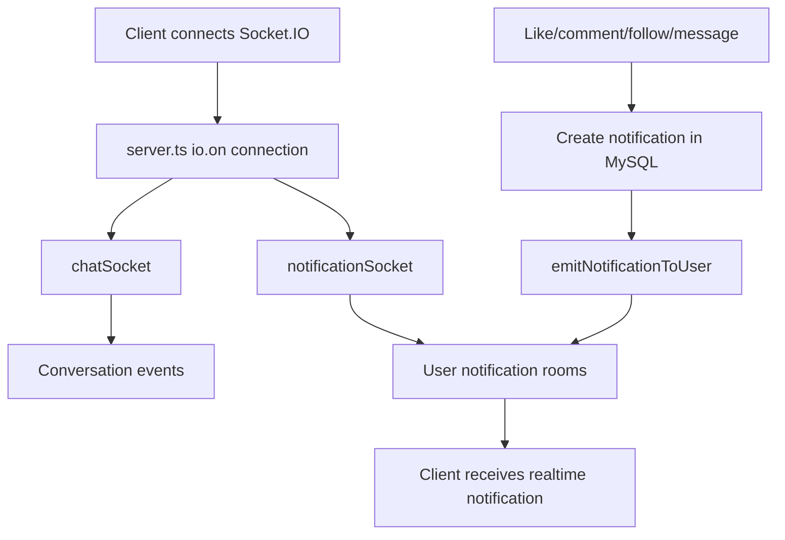

Realtime is used for:

- notifications on like/comment/follow/new post/new story;
- private and group chat;
- new comments on a post.

## AI moderation flow

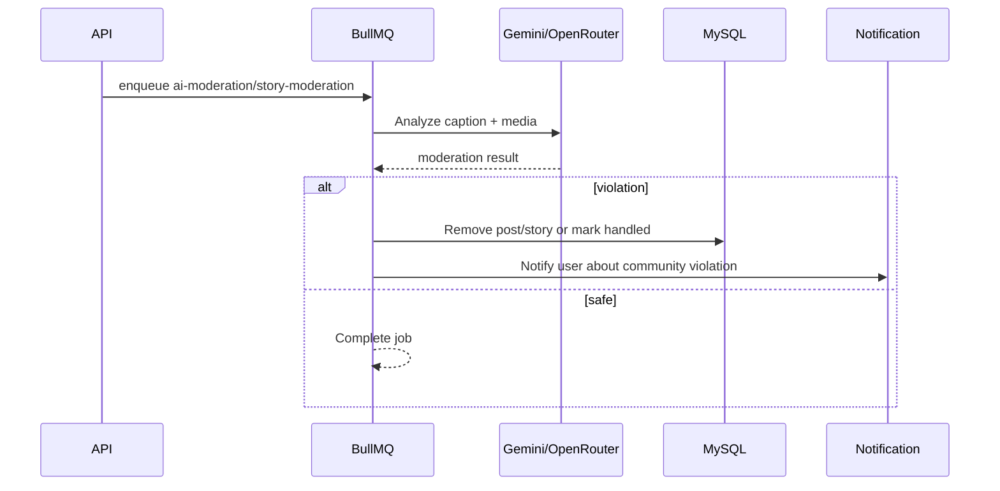

Moderation runs asynchronously so it does not slow down uploads or post creation. If the AI service fails, BullMQ retries with exponential backoff before routing to the DLQ.

## Cache consistency strategy

| Scenario | Handling |
| --- | --- |
| New post | Fan-out job writes `post:data` and `feed:{userId}` |
| Update caption/location/tags | Refresh `post:data:{postId}` |
| Like/unlike | Refresh `post:data:{postId}` for updated count |
| Comment/delete comment | Refresh `post:data:{postId}` for updated count |
| Delete post | Delete `post:data`, ZREM post ID from follower feeds |
| Follow user | Warm feed with 10 most recent posts from target |
| Unfollow user | Remove target's posts from viewer feed |
| Cache miss on feed read | Fallback to DB, then re-cache |
| Orphan post ID | Remove from feed |
| Redis down | API still has DB as source of truth; queue/cache can recover |

The system accepts **eventual consistency** for the feed cache. What matters is that the database is always correct; the cache can be refreshed or self-healed on read.

## API surface

Base path: `/api/v1`.

### Auth

| Method | Path | Purpose |
| --- | --- | --- |
| `POST` | `/api/v1/auth/register` | Register |
| `POST` | `/api/v1/auth/login` | Login |
| `POST` | `/api/v1/auth/logout` | Logout |
| `POST` | `/api/v1/auth/reset-password-direct` | Reset password |

### Post & feed

| Method | Path | Purpose |
| --- | --- | --- |
| `GET` | `/api/v1/posts/feed` | Get ranked feed |
| `GET` | `/api/v1/posts/upload-signature` | Get Cloudinary upload signature |
| `POST` | `/api/v1/posts` | Create post |
| `GET` | `/api/v1/posts/:postId` | Post detail + comments |
| `PATCH` | `/api/v1/posts/:postId` | Update caption/location/tags |
| `DELETE` | `/api/v1/posts/:postId` | Delete post + async cleanup |

### Interaction

| Method | Path | Purpose |
| --- | --- | --- |
| `POST` | `/api/v1/post-likes/:postId` | Like post |
| `DELETE` | `/api/v1/post-likes/:postId` | Unlike post |
| `GET` | `/api/v1/comments/:postId` | List comments with cursor |
| `POST` | `/api/v1/comments/:postId` | Create comment |
| `DELETE` | `/api/v1/comments/:commentId` | Delete comment |

### Follow

| Method | Path | Purpose |
| --- | --- | --- |
| `POST` | `/api/v1/follow` | Follow or send follow request |
| `DELETE` | `/api/v1/follow` | Unfollow or cancel request |
| `POST` | `/api/v1/follow/accept` | Accept follow request |
| `POST` | `/api/v1/follow/reject` | Reject follow request |
| `GET` | `/api/v1/follow/suggestions` | Follow suggestions from Neo4j |
| `GET` | `/api/v1/users/:userId/followers` | Followers list |
| `GET` | `/api/v1/users/:userId/following` | Following list |

### Story

| Method | Path | Purpose |
| --- | --- | --- |
| `GET` | `/api/v1/stories/feed` | Story feed |
| `POST` | `/api/v1/stories` | Create story |
| `GET` | `/api/v1/stories/me` | My stories |
| `GET` | `/api/v1/stories/users/:userId` | User's stories |
| `DELETE` | `/api/v1/stories/:id` | Delete story |
| `POST` | `/api/v1/stories/highlights` | Create highlight |
| `GET` | `/api/v1/stories/highlights/me` | My highlights |
| `PATCH` | `/api/v1/stories/highlights/:highlightId` | Update highlight |

### Notification, profile, user, conversation

| Group | Sample endpoints |
| --- | --- |
| Notification | `GET /api/v1/notifications`, `GET /summary`, `PATCH /read-all`, `DELETE /read` |
| Profile | `GET /api/v1/profile/users/:userId`, `PATCH /me`, `POST /users/:userId/search-view` |
| User | `GET /api/v1/users/search`, `GET /api/v1/users/:id` |
| Conversation | private chat, group chat, members, messages, read state |

## Installation and running the project

### 1. Install dependencies

```bash
npm install
```

### 2. Create a `.env` file

```env
JWT_SECRET=your_jwt_secret

CLOUDINARY_CLOUD_NAME=your_cloud_name
CLOUDINARY_API_KEY=your_api_key
CLOUDINARY_API_SECRET=your_api_secret
CLOUDINARY_POST_FOLDER=posts
CLOUDINARY_STORY_FOLDER=stories

REDIS_URL=redis://127.0.0.1:6379
REDIS_URL_QUEUE=redis://127.0.0.1:6379

NEO4J_ENABLED=true
NEO4J_URI=neo4j://127.0.0.1:7687
NEO4J_USERNAME=neo4j
NEO4J_PASSWORD=your_password
NEO4J_DATABASE=neo4j

GEMINI_API_KEY=your_gemini_key
GEMINI_MODEL=gemini-1.5-flash-latest
OPENROUTER_API_KEY=your_openrouter_key
OPENROUTER_MODEL=google/gemini-2.0-flash-exp:free
```

Database config lives in `src/core/config/database.ts` and `src/data-source.ts`.

### 3. Run migrations

```bash
npm run build
npm run migration:run
```

### 4. Start the dev server

```bash
npm run dev
```

Server runs at:

```text
http://localhost:3000
```

## Interview highlights

### 1. An intentional feed serving layer

The project does not query the feed directly from the database on each request. Instead:

- A Redis sorted set stores the list of post IDs per user.
- A Redis hash stores post snapshots.
- The API re-ranks at read time.
- Cache misses self-heal from the database.

This reflects a system design mindset for read-heavy workloads, well-suited to a social network.

### 2. Controlled fan-out on write

Post creation does not block on follower count. The API only enqueues a job; the worker handles fan-out via a Redis pipeline, with retry and DLQ. This demonstrates that latency, reliability, and operational concerns have been thought through.

### 3. Practical eventual consistency

Changes such as likes, comments, and updates do not rebuild the entire feed. The system refreshes the `post:data:{postId}` snapshot and leaves the feed ID list unchanged. This is an effective way to reduce the blast radius of cache invalidation.

### 4. Explicit ranking formula

Ranking is not magic. The formula combines:

- log-scaled engagement;
- exponential decay for recency;
- an interest profile derived from user behavior.

This makes ranking easy to debug — the API exposes `ranking_debug` when debug mode is enabled.

### 5. Dedicated graph recommendations

Follow suggestions use Neo4j to query the mutual-follow and search-view graph. This is a meaningful differentiator compared to a typical CRUD backend.

### 6. Queue-driven risky operations

Cloudinary cleanup, AI moderation, fan-out, cache refresh, and interaction tracking are all handled by BullMQ. When an external service fails, the system retries and moves jobs to the DLQ instead of failing the primary request.

### 7. Realtime alongside persistent data

Notifications are written to MySQL first, then emitted via Socket.IO. The client gets real-time updates immediately, but a page reload will still show the persisted data.

## Future improvements

- Extract workers into separate processes/containers for independent scaling from the API.
- Use a Redis cluster or partition `feed:{userId}` by user ID.
- Add hybrid fan-out: celebrity accounts use fan-out on read or partial fan-out to avoid excessive write amplification.
- Add an outbox pattern to ensure job enqueuing is atomic with the database transaction.
- Add observability: queue latency, DLQ count, feed cache hit rate, p95 feed latency.
- Add Redis TTL/eviction policy for old post snapshots.
- Add background feed rebuilding for inactive users when they return.
